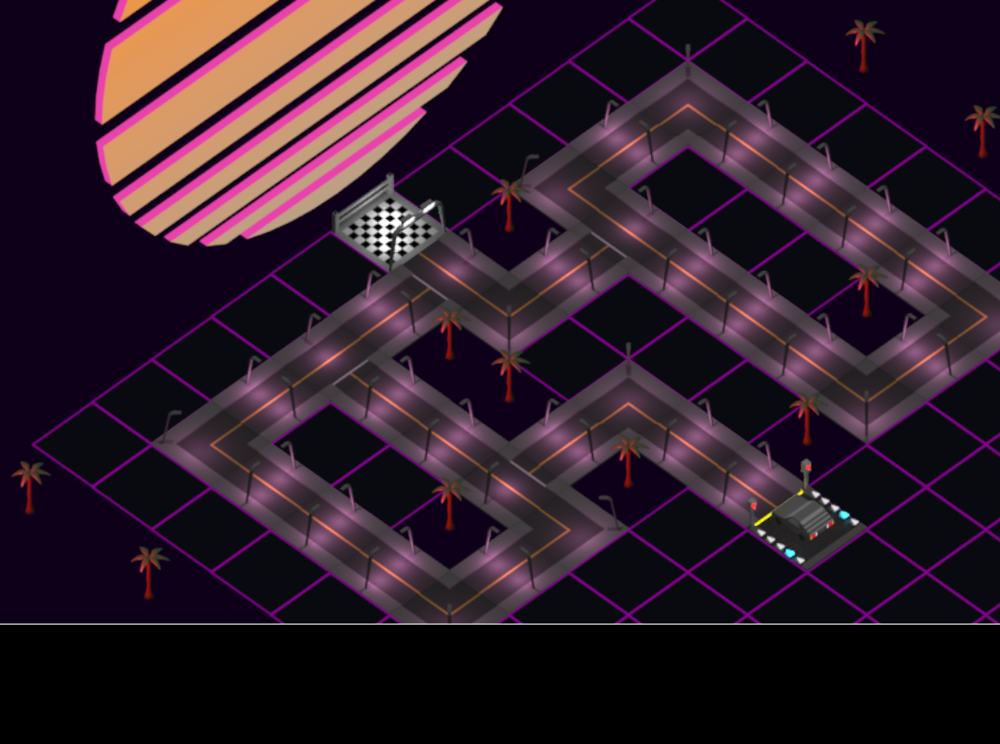

# Retro Maze - Isometric projection attempt



**A simple attempt to create the basics of a game based on isometric projection.**

## Information
 * Developed in Rust with Piston
 * Graphics created with Blender

## Build the environment

```sh
vagrant up
```

## Connect to the environment

```sh
vagrant ssh
```

## Build the project

```sh
cargo build --release
```

## Run the project

```sh
./target/release/retro-maze
```
